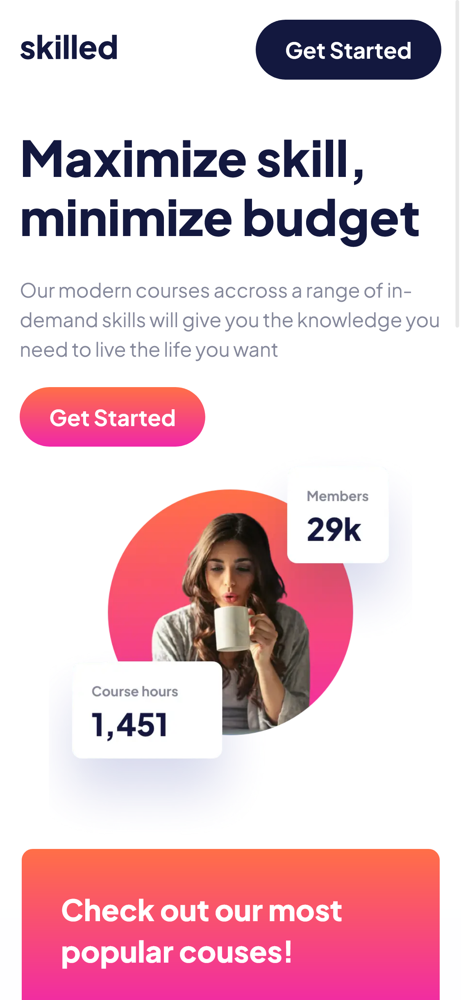
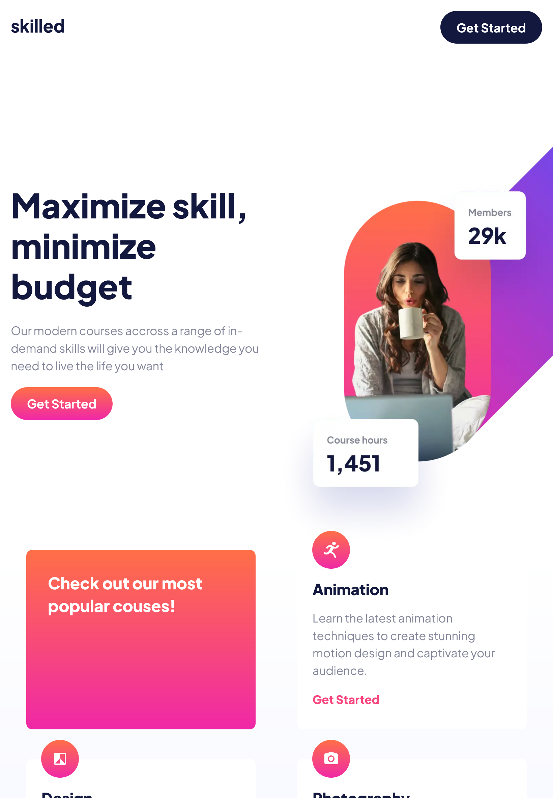
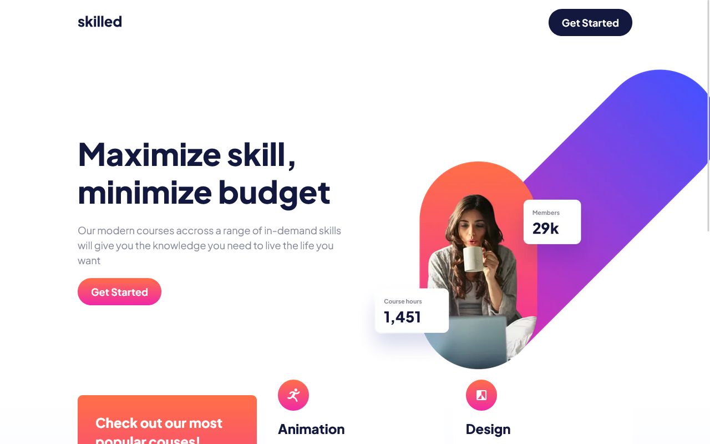

# Frontend Mentor - E-Learning Landing Page

This is a solution to the [E-Learning Landing Page challenge on Frontend Mentor](https://www.frontendmentor.io/challenges/skilled-elearning-landing-page-S1ObDrZ8q). Frontend Mentor challenges help you improve your coding skills by building realistic projects.

## Table of contents

- [Overview](#overview)
  - [The challenge](#the-challenge)
  - [Mobile Screenshot](#mobile-screenshot)
  - [Tablet Screenshot](#tablet-screenshot)
  - [Desktop Screenshot](#desktop-screenshot)
  - [Links](#links)
- [My process](#my-process)
  - [Features](#features)
  - [What I learned](#what-i-learned)
- [Author](#author)

## Overview

### The challenge

Users should be able to:

- View the optimal layout depending on their device's screen size
- See hover and focus states for interactive elements

### Mobile Screenshot

### Tablet Screenshot

### Desktop Screenshot

### Links

- Live Site URL: [Product preview card](https://frontendmentor-product-preview-card-ten.vercel.app/)

## My process

### Features

- Responsive design (mobile, tablet, desktop) using CSS Grid & Flexbox
- Custom buttons and card components for reusability
- Gradient-based CTAs and interactive buttons
- Optimized images with `<picture>` for different screen sizes
- Semantic HTML5 markup
- CSS custom properties
- Flexbox
- BEM
- Components based approach
- Mobile-first workflow

### What I learned

- Structuring projects with reusable **components**
- Handling **responsive images** using the `<picture>` element
- Creating reusable **button variants** with BEM & utility-first CSS
- Improving my grasp of **layout techniques** (Grid & Flexbox)

## Author

Github - [Lewis](https://github.com/Lewis-mbui)
